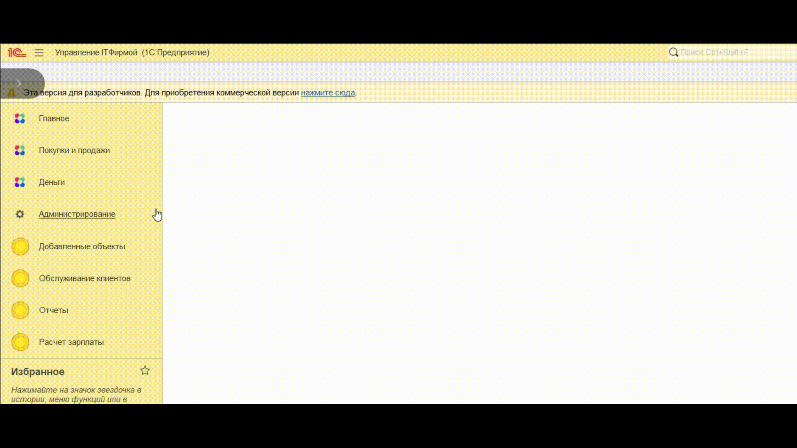
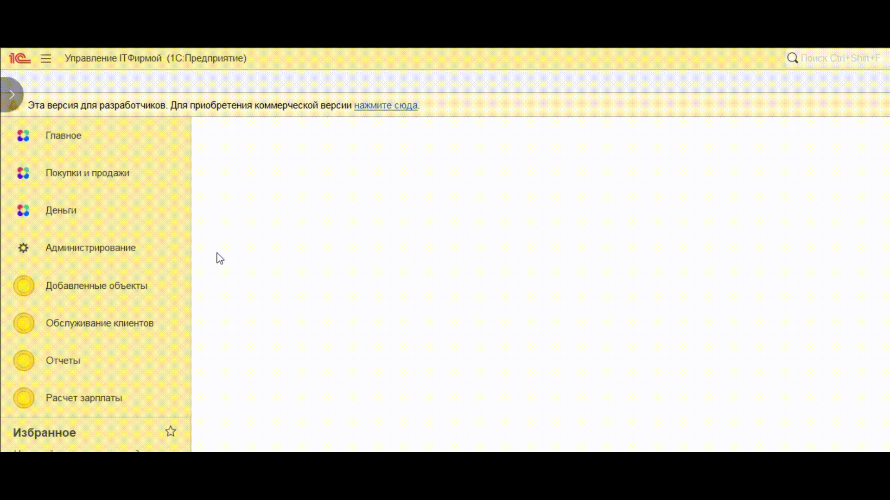
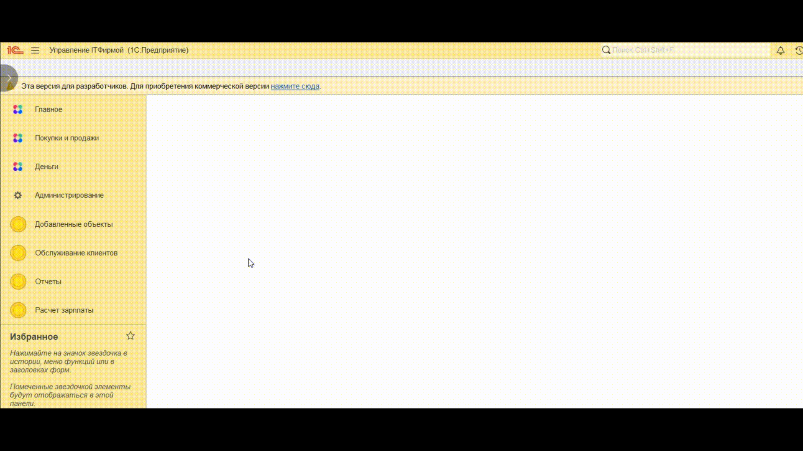
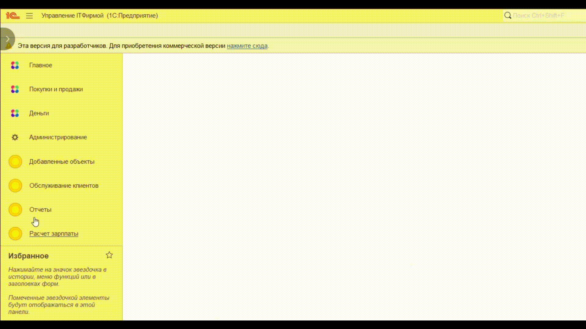
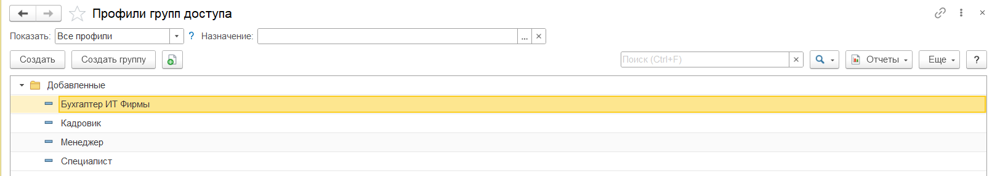

# Дипломный проект профессии «1C-программист: с нуля до middle» Кошеляевского А.Ю.

## Кастомизация конфигурации «Управление IT-фирмой для компании «Ваш компьютерный мастер»

Выполнены работы по улучшению функционала конфигурации «Управление IT-фирмой для компании «Ваш компьютерный мастер» а именно:

- реализованы новые подсистемы «Работа с заявками клиентов» и «Расчёт управленческой зарплаты» в соответствии с требованиями заказчика,
- подготовлены отчёты по новой функциональности,
- оформлена инструкция по начальной настройке,
- подготовлен автотест для проверки корректности работы подсистемы «Работа с заявками клиентов»,
- загружен результат работы в новый репозиторий на GitHub.

------

### Подробные требования к подсистемам

- [Работа с заявками клиентов](tasks/tickets.md).
- [Расчёт управленческой зарплаты](tasks/hrm.md).
- [Отчёты](tasks/reports.md).
- [Инструкция по начальной настройке](tasks/docs.md).
- [Тестирование](tasks/testing.md).

------

## Инструкция по начальной настройке конфигурации

### Телеграм бот

Для корректной работы отправки сообщений в чат телеграма неоходимо заполнить две константы: "Идентификатор группы для оповещения"

 и "Токен управления телеграм ботом"

 

------

### Вычисление оборота денег 

Для корректной работы вычисления зарплаты и выставления счетов заказчикам необходимо заполнить две константы: "Номенклатура абонентская плата"

и "Номенклатура работы специалиста"

------

### Так же имеются 4 профиля для быстрого доступа к правам добавленых возможностей

    Менеджерам назначается профиль «Менеджер» 
    Кадровикам-расчетчикам назначается профиль «Кадровик расчетчик»
    Бухгалтерам назначается профиль «Бухгалтер ИТ фирмы» 
    Специалистам назначается профиль «Специалист» 

------

### Также для работы с автоматическими тестами на базе vanessa automation нужно [выполнить настройки](autotest/Инструкция%20по%20автотестам.md)

